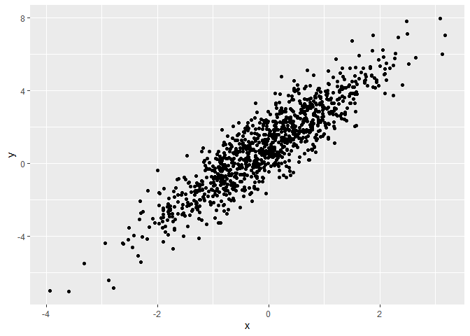

Simple document
================

``` r
library(tidyverse)
```

    ## ── Attaching packages ─────────────────────────────────────── tidyverse 1.3.2 ──
    ## ✔ ggplot2 3.3.6      ✔ purrr   0.3.4 
    ## ✔ tibble  3.1.8      ✔ dplyr   1.0.10
    ## ✔ tidyr   1.2.0      ✔ stringr 1.4.1 
    ## ✔ readr   2.1.2      ✔ forcats 0.5.2 
    ## ── Conflicts ────────────────────────────────────────── tidyverse_conflicts() ──
    ## ✖ dplyr::filter() masks stats::filter()
    ## ✖ dplyr::lag()    masks stats::lag()

I’m an R Markdown document!

# Section 1

Here’s a **code chunk** that samples from a *normal distribution*:

``` r
samp = rnorm(100)
length(samp)
```

    ## [1] 100

``` r
x=0
```

# Section 2

I can take the mean of the sample, too! The mean is -0.0969259.

# Section 3

## subsection

### subsubsection

This is going to make a plot ctrl+alt+i to create code chunks need to
load libraries every time knit \# “echo = false” to hide code in viewer
\# “eval = false” to hide result \# {r name_of_the_chunk}

``` r
plot_df =
  tibble(
    x = rnorm(n=1000),
    y = 1 + 2 * x + rnorm(n = 1000)
  )

ggplot(plot_df, aes(x = x, y = y)) + geom_point()
```

<!-- -->
